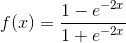

# 激活函数

节点的激活函数定义了该节点在给定的输入或输入的集合下的输出。标准的计算机芯片电路可以看作是根据输入得到"开"(1)或"关"(0)输出的数字网络激活函数。这与神经网络中的线性感知机的行为类似。 一种函数（例如 ReLU 或 S 型函数），用于对上一层的所有输入求加权和，然后生成一个输出值（通常为非线性值），并将其传递给下一层。

如果不用激励函数，每一层输出都是上层输入的线性函数，无论神经网络有多少层，输出都是输入的线性组合。如果使用的话，激活函数给神经元引入了非线性因素，使得神经网络可以任意逼近任何非线性函数，这样神经网络就可以应用到众多的非线性模型中。

## TensorFlow的激活函数

### 1. Sigmoid

$f(x)=\frac{1}{1+e^{-x}}$

    tf.nn.sigmoid(x, name = None)

sigmoid函数输出的函数会落到(0,1)的区间内。随着ｘ接近正负无穷，y接近1或者0，这种情况叫做饱和。当ｘ取值在-3~3时，会有较好的效果。

**优点：**

1.Sigmoid函数的输出映射在(0,1)之间，单调连续，输出范围有限，优化稳定，可以用作输出层。

2.求导容易。

**缺点：**

1.由于其软饱和性，容易产生梯度消失，导致训练出现问题。

2.其输出并不是以0为中心的。

### 2. Tanh

    tf.nn.tanh(x, name = None)

同样存在饱和问题，所以使用时输入的值域不能过大，否则无法训练。

**优点：**

1.比Sigmoid函数收敛速度更快。

2.相比Sigmoid函数，其输出以0为中心。

**缺点：**

没有改变Sigmoid函数的最大问题——由于饱和性产生的梯度消失。

### 3. ReLU

## 参考

[【简书】常用激活函数比较](https://www.jianshu.com/p/22d9720dbf1a)

[【机器之心】激活函数](https://www.jiqizhixin.com/graph/technologies/1697e627-30e7-48a6-b799-39e2338ffab5)
