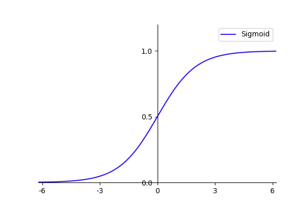
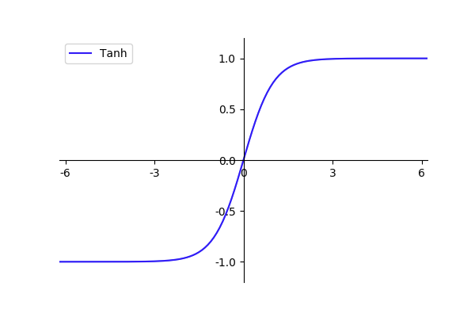
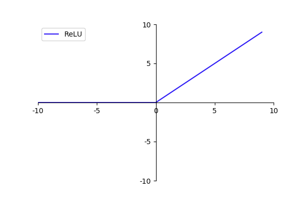
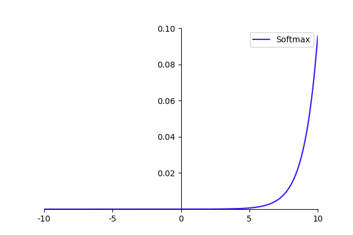
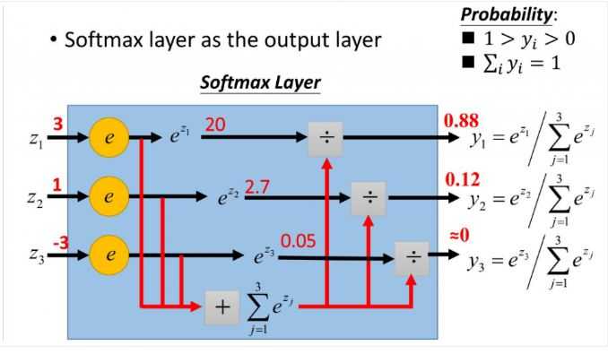

# 激活函数总结

@(DL Learning)[DL, Summary]


激活函数主要作用是加入非线性因素，解决线性模型表达能力不足的缺陷。

[代码链接](https://github.com/huuuuusy/Deep-Learning-Practice-Everyday/tree/master/Others/%E6%BF%80%E6%B4%BB%E5%87%BD%E6%95%B0%E7%BB%98%E5%88%B6)

## 1-Sigmoid

- **函数形式**：$f(x)=\frac{1}{1+e^{-x}}$
- **图像**：https://app.yinxiang.com/fx/6142562f-7d17-4a7b-8eed-34f5e500534d

<div align=center>

- **特点**：
 > 函数输出会落在**(0,1)区间**
- **TF指令**：

```
tf.nn.sigmoid(x, name=None)
```

- **注意**：
> 随着x接近正负无穷，y会接近1或者0，产生饱和现象，**所以为了有效使用Sigmoid函数，横轴取值极限只能是[-6,6]，在[-3,3]之间效果更好**。

## 2-Tanh

- **函数形式**：$f(x)=\frac{1+e^{-2x}}{1+e^{-2x}}$
- **图像**：

<div align=center>

- **特点**：
 >函数输出会落在**(-1,1)区间**
- **TF指令**：

```
tf.nn.tanh(x, name=None)
```

- **注意**：
> 和Sigmoid函数一样具有**饱和现象**，需要注意输入值的范围不能过大，否则无法训练

## 3-ReLU

- **函数形式**：$f(x)=max(0,x)$
- **图像**：
    - 普通版本：
    
<div align=center>

    - 以6为阈值版本：
    
<div align=center>

- **特点**：
 >对正向信号重视，忽视负向信号。
 >运算简单，提升机器运行效率。
- **TF指令**：

```
tf.nn.relu(features, name=None) # 普通版本
tf.nn.relu6(features, name = None) # 以6为阈值版本
```

- **注意**：
>**以6为阈值是为了避免梯度爆炸**。
>当节点和层数都特别多并且输出为正时，它们的和是一个很大的值，尤其是经过几层变换后，最终值可能会离目标值相差太远，出现误差过大，使得对参数的调整修正值过大，难以收敛。

## 4-小结

- **Tanh**函数在特征相差明显时效果较好，在循环过程中会不断扩大特征效果并且显示出来。
- 当计算的特征间的相差虽然复杂但是没有明显区别时，或者特征之间的相差不是特别大时，需要更细微的分类判别，此时**Sigmoid**效果更好。
- **ReLU**的优势是经过其处理后的数据有更好的稀疏性，即，将数据转化为只有最大的数值，其他均为0;这种变换可以最大程度保留数据特征，用大部分元素均为0的稀疏矩阵来实现。以稀疏矩阵来表示原有数据特征的方法，使得神经网络在迭代时能够取得又快又好的效果。

## 5-Softmax

- **函数形式**：$S_i=\frac{e_i}{\sum_{j}e^j}$
- **图像**：(以输入-10~10之间等间距的200个点为例)

<div align=center>

- **特点**：
 >Softmax用于**多分类任务**，它将多个神经元的输出映射到(0,1)区间内，数值越大则表示属于该分类的可能性越大。由上图可知，**当输入越大时，其输出的概率值越大**。
 > **输入经过softmax计算后，输出的值的总和变为1**。
- **计算原理**:

<div align=center>

- **TF指令**：

```
tf.nn.softmax(logits, name = None)
```

- **注意**：
>实际使用中，softmax伴随的分类标签都为one-hot编码。
>在softmax时需要将目标分成几类，就在最后的输出层放几个节点。
